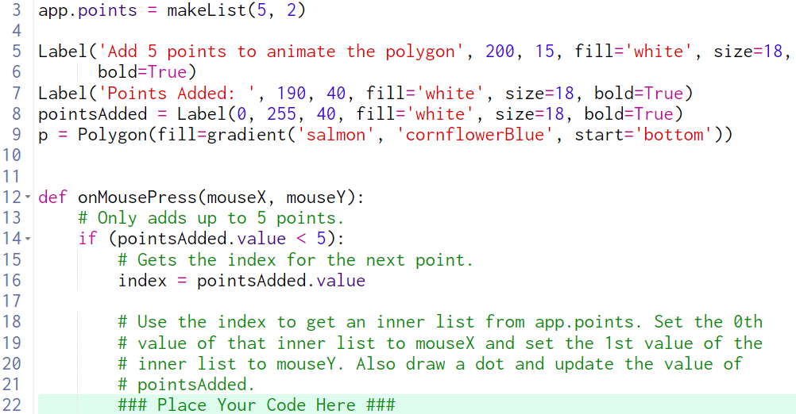

# 11.1.1 Animate Polygons Guiding Questions

## Review all of the code before proceeding.

Use the index to get an inner list from app.points

What is "the index"?

> The variable `index` on line 16

What does an "inner list" in app.points represent?

> A single point (coordinate)

What is app.points?

> `app.points` is a 2D list with 5 rows and 2 columns

How do you get an inner list from app.points?

> Use `listName[i]` to get an item out of a list at index `i`

What should you do with the inner list?

> Store it in a variable, maybe called `point`

How do you store it?

> `point = app.points[index]`

Set the 0th value of that inner list to mouseX

What is "that inner list"?

> You should have named it `point` if you followed the previous set of questions

How do you "set the 0th" value?

> Use `L[i] = n` to set the ith value of the list `L` to `n`

Set the 1st value of the inner list to mouseY

> Read the previous questions

Also draw a dot

What shape are the dots?  What properties do you need to set?

> Run the solution and click the screen and examine the dots to figure out what shape they are and the properties to set.

Update the value of pointsAdded

What is pointsAdded?

> `pointsAdded` is a label that holds the number of points that have been added.

How many points did you add?

> We clicked once, adding 1 point.  So we need to increase `pointsAdded.value` by 1.

