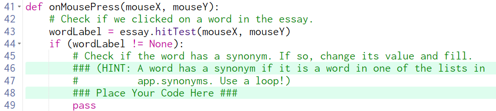

# 11.1.3.3 Essay Editor



## Review all code before proceeding

<details><summary>Check if the word has a synonym</summary>

<details><summary>What word?</summary>

> The word that was clicked, the value of `wordLabel`
</details>

<details><summary>How do you check if it has a synonym?</summary>

> Read the hint on line 46

<details><summary>How do you use a loop to do this?</summary>

> Use a `for` loop and iterate over each list in app.synonyms.

> Since we need to keep track of which list the word is in, use `for i in range(len(app.synonyms))`:
</details>

<details><summary>How do you check if the word is in one of the lists?</summary>

> Since each list only has 2 items, you can easily check if the word matches the first item or if it matches the second item.

```
for i in range(len(app.synonyms)):
    if app.synonyms[i][0] == wordLabel.value:
        # do something
    elif app.synonyms[i][1] == wordLabel.value:
        # do something else
```
 
</details>
</details>
</details>

<details><summary>If so, change its value and fill.</summary>

> Be sure you have completed everything from the first part before doing this!

<details><summary>What is "it"s?</summary>  

> `wordLabel`
</details>

<details><summary>What do we change its value to?</summary>

> Inside of the `if/elif` statements from above, if the word is at index 0, `wordLabel.value` should change to the word at index 1.  If the word is at index 1, `wordLabel.value` should change to the word at index 0.

<details><summary>How do we do that?</summary>

> Just the first one (you figure out the second)...

```
if wordLabel.value == app.synonyms[i][0]:
    wordLabel.value = app.synonyms[i][1]
```

</details>
</details>

<details><summary>What do we change the color to?</summary>

> Inspect the solution to determine the new fill color.
</details>
</details>