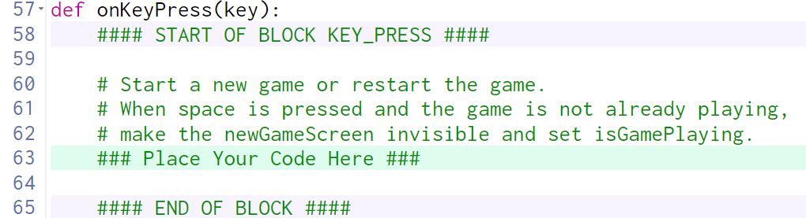

# Tic Tac Toe Part 1 Guiding Questions

## Review all of the code in the assignment before proceeding

Calculate x, y for each row, col

Does x depend on row or col?

> Since columns are vertical, changing columns moves us side-to-side.  The x-value depends on which column we are in.

What are the values that col is going to be?

> Since `col` gets its value in the `for` loop on line 10, `col` will get values `0`, `1`, and `2`.

What are the corresponding x-values?

> Inspecting the picture shows that the x-values of the cells are `0`, `133`, and `267`.

x doesn't appear to be changing by a constant amount...what's going on?

> Since the canvas is 400 pixels wide and we want 3 equally sized cells, the width of each cell is `400 / 3`.  There is a variable on line 8, `cellSize` containing that value.

So what is x?

> `x = col * cellSize`

Does y depend on row or col?

> Since rows are horizontal, channgin rows moves us up and down.  The y-value depends on which row we are in.

What are the values that row is going to be?

> Since `row` gets its value in the `for` loop on line 10, `row` will get values `0`, `1`, and `2`.

What are the corresponding y-values?

> Inspecting the picture shows that the y-values of the cells are `0`, `133`, and `267`.

y doesn't appear to be changing by a constant amount...what's going on?

> Since the canvas is 400 pixels wide and we want 3 equally sized cells, the width of each cell is `400 / 3`.  There is a variable on line 8, `cellSize` containing that value.

So what is y?

> `y = row * cellSize`

and add a rectangle to the board group.

Where should the rectangle go?

> The top left of each rectangle should go in the `x` and `y` that we just calculated.

What should the width and height be?

> Since the cells are squares, the width and height should both be `cellSize`.

What other properties need to be set?

> `border`, `fill`, and `borderWidth` should be set based on inspecting the picture.

What else are you forgetting?

> The rectangle needs to be added to the board group using `board.add()`

  

Calculate the center of each cell

What does the hint say?

> The hint says, "Add `cellSize / 2` to `x` to get the center of the cell.

So, what do you do?

> Create a local variable called `centerXOfCell` and assign its value using the hint.

> Create another local variable called `centerYOfCell` and assign its value using the hint (what will be different?)

and add a label there.

What are the required parts of a label?

> `text`, `centerX`, `centerY`

What should you use for each?

> Use an empty string for the text `''`
> Use `centerXOfCell` for `centerX` and `centerYOfCell` for `centerY`

Also assign the label into app.board

What is app.board?

> `app.board` is a 2D list.

How do we assign things to 2D lists?

> Using `app.board[row][col] = label`

Why doesn't that work?

> `label` isn't a thing yet.  You need to create the local variable `label` and assign it the `Label` you created in the previous step.

> `label = Label('', centerOfCell, centerOfCell)`

and add it to the board Group.

What is "it"?

> It is the label that you created in the previous step.  Add it to the group `board` using `board.add()`

---

## Review all of the code before proceeding

Start a new game or restart the game.

> This is just describing *what* this function needs to do, not *how* to do it.

When space is pressed and the game is not already playing,

How do we check for when things are happening?

> Using an `if` statement

If what?

> space is pressed

and what else?

> and game is not already playing

How do we check for if the game is not already playing?

> There is a variable created at the end of `initializeGame` called `app.isGamePlaying`.  If it is `False`, the game is not playing.

make the newGameScreen invisible

How do you do that?

> Set the `visible` property of `newGameScreen` to `False`

and set isGamePlaying.

Set it to what?

> Well, since the game is now playing, `app.isGamePlaying` should be set to `True`.

