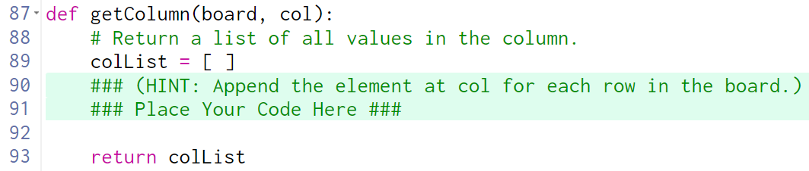
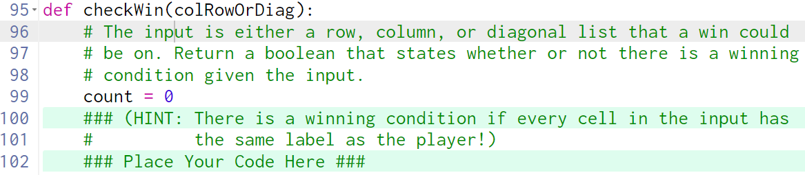

# Tic Tac Toe Part 3 Guiding Questions

## Review all of the code before proceeding

Return a list of all values in the column.

What does the hint say?

> Append the element at `col` for each row in the board.

Append the element to what?

> The only thing that makes sense is `colList`

How dow we get the element at col for each row?

> The parameter `board` must be a 2D list of **Labels**.  We can use a for loop:

    for row in range(len(board)):
        colList.append(board[row][col].value)

---

## Review all code before proceeding

What does checkWin do?

> It will return `True` if there is a winner, and `False` otherwise.

What is colRowOrDiag?

> It is a list with exactly 3 values in it.

What is the purpose of the count variable?

> While it is initially unclear, we can use it to determine how many of the items in `colRowOrDiag` are the same as `app.player`

How could you do that?

> Use a for loop going through each item in `colRowOrDiag` and if it is the same as `app.player` add one to `count`

What do you do with that?

> After the loop finishes, if `count` is 3, then all 3 values in `colRowOrDiag` must have been the same as `app.player`, so return `True`.  If `count` isn't 3, then at least one of the values must not have been the same, so return `False`

