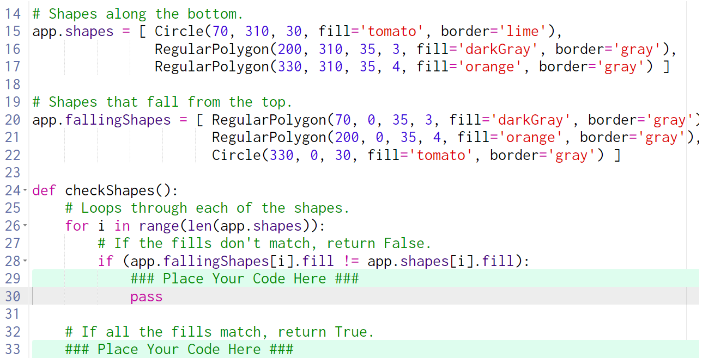
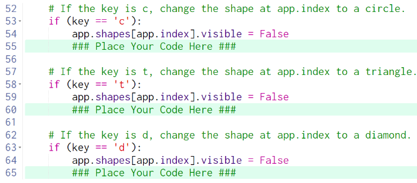

# 10.4.1 Shape Invaders Guided Questions

## Review all of the code above before proceeding

What does the comment on line 27 say?

> It says, "If the fills don't match, return False"

How do you do that?

> You return a value by using the keyword `return` followed by the thing you want to return.  In this case, you are told to return the boolean value `False`.

What does the comment on line 32 say?

> It says, "If all the fills match, return True"

How do you do that?

> If the `for` loop on line 26 finished without returning `False`, the conditional on line 28 must have never occurred, so the function should return the boolean value `True` on line 33, outside of the loop (but inside of the function)

## Review all of the code above before proceeding

What is meant by "the shape at app.index"?

> It means the shape in `app.shapes` at index `app.index`, in other words: `app.shapes[app.index]`

How do you change the value of something?

> Use the `=` operator to assign a new value.

How do you change the shape at app.index to a circle?  Hint: Look at lines 15-17

> This one is a little tricky, only because it seems *weird*.  You actually create a brand new `Circle`, exactly like the one on _line 15_, and assign it to `app.shapes[app.index]`.  Weird, I know.

How do you change the shape at app.index to a triangle?

> Look at the previous answer, but determine which shape is a triangle.  Copy and paste is probably a good idea here.

How do you change the shape at app.index to a diamond?

> Did you really just look here? Read the previous two answers!

What is happening now?

> The shape should seem to be disappearing.  This is because when you copy and pasted the shapes, you didn't change their positions!  

What already created variable could be used for the horizontal position of the new shapes that you created?

> The `x` variable on line 43 is a perfect fit. 

What value in the shapes that you created needs to be changed?

> In the circle, change the 70 to `x`, in the triangle change 200 to `x`, in the diamond change 330 to `x`.

Why doesn't it match the solution yet?

> Check the border color of your newly created shapes.  

What color should they be?

> lime

