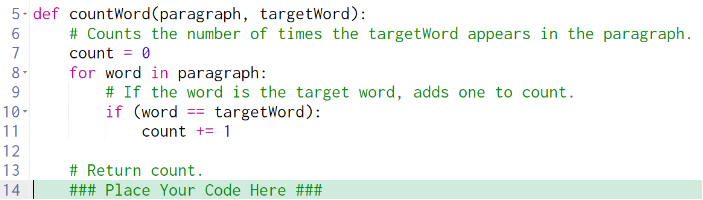
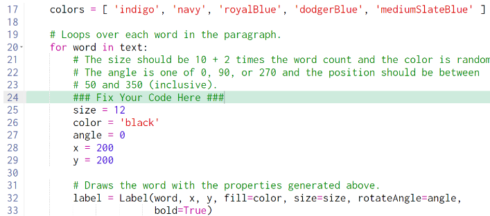

# 10.4.3 Word Cloud Guiding Questions

## Review the code above before proceeding

What does this function do?

> It counts the number of times a target word appears in a paragraph.

What does the comment on line 13 say to do?

> "Return count"

How do you do that?

> You return a value using the word `return` followed by the value/variable you want to return.  In this case the function is supposed to return the value of `count`.

> Make sure to return *outside* of the loop.

---

## Review the code above before proceeding

According to the comments on line 21-23, what variables are you going to be giving values to?

> `size`, `color`, `angle`, `x`, `y`

Where in the code will you be giving them values?

> On lines 25, 26, 27, 28, 29

What should the size be?

> According to the comment on line 21, the size should be "10 + 2 times the word count"

How do you get the word count?

> Use the helper function `countWord` that you finished above.

What are the parameters of wordCount and where do you get their values?

> The parameters are `paragraph` and `targetword` (see line 5).  The variable `text` should be passed in for `paragraph`, and `word` for `targetword`.  

How do you call wordCount?

> `countWord(text, word)`

What variable should you assign the result to?

> `size`

What should color be?

> According to the comment on line 21, color is random.

How do you get a random thing out of a list?

> Use the `choice` function. `choice(listName)` returns a random item from a list called `listName`.

What should angle be?

> 0, 90, or 270, apparently at random

How could you get that angle value?

> There are a few ways, but one way would be to use `choice` again, but put the list containing the values 0, 90, and 270 as the argument. That is, instead of `choice(listName)` you can put `choice([0, 90, 270])`.

What should x and y be?

> Random values between 50 and 350 inclusive.  Review `randrange` if you aren't sure how to do this.

---
### FAQs

My program works, but the text is super small.  What did I do wrong?

> You probably forgot that the size is supposed to be 10 + 2 times wordcount, not just wordcount.

