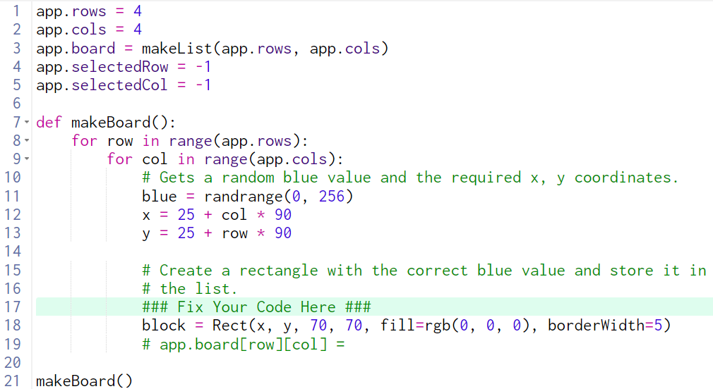
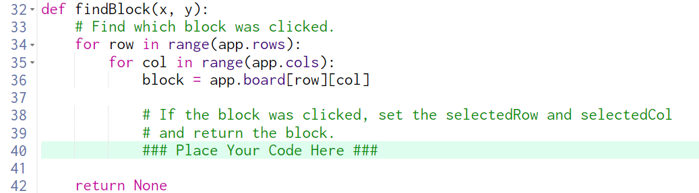

# 11.1.3.1 Color Blocks

## Review all of the code before proceeding

Create a rectangle with the correct blue value...

What is "the correct blue value?"

> The value in the variable `blue`

What property of the block needs to change?

> The blue part of the rgb in the `fill` property should be `blue`

and store it in the list.

What needs to be stored in the list?

> The `block` needs to go in the list.

What list?

> `app.board`

Where in the list?

> `app.board[row][col]`

---

## Review all of the code before proceeding

If the block was clicked, set the selectedRow and selectedCol

How do you check if the block was clicked?

> Use `if block.hits(x, y):`

What does it mean "selectedRow" and "selectedCol"?

> It's referring to the global variables, `app.selectedRow` and `app.selectedCol`.

What do they need to be set to?

> `app.selectedRow` should be set to `row` and `app.selectedCol` should be set to `col`

and return the block

What block?

> The variable `block` from line 36.  
> Use the `return` keyword to return it from the function.  
> Double check your indentation (it should be indented inside of the `if` statement)

---

## If it still doesn't pass the tests...

Read the error in the console, what does it say?

> `AttributeError: 'Shape' object has not attribute 'blue'`

What does that mean?

> On line 26 it is trying to access the property `blue` of a block, but a `block` doesnt' have a `blue` property.

What do we do about that?

> Give `block` a property called `blue` on line 19 
> Insert a line `block.blue = blue`

