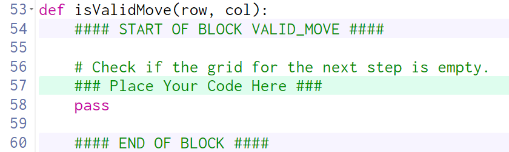
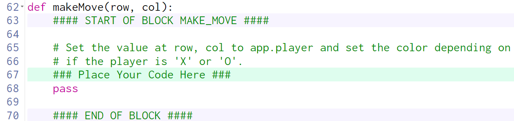

# Tic Tac Toe Part 2 Guiding Questions

## Review all of the code before proceeding

What is the purpose of the isValidMove function?

> It needs to check if app.board already has something in the given `row` and `col` parameters.  

> If we look at line 90, we can see that `isValidMove` is called as part of an `if` statement, which means it needs to return either `True` (if it's a valid move) or `False` (if it's not a valid move).

How would we know if a move is valid?

> A move would be  valid if the label at the indicated `row` and `column` has an empty string.

How do we check that?

> `app.board[row][col]` is a `Label`.  Check its `value` property to see if it's an empty string (`''`).  

> If it is an empty string, return `True`, otherwise return `False`

---

## Review all of the code before proceeding

What is the purpose of the makeMove function>

> To put an X or O (depending on `app.player`) into the board.

Set the value at row, col to app.player

Set the value at row, col in what?

> The only thing that makes sense is the 2D list: `app.board`

How do we set the value in app.board at row, col?

> Since `app.board` is a 2D list of **labels**, you need to set `app.board[row][col].value` to `app.player`.

and set the color depending on if the player is 'X' or 'O'

How do we do something depending on if...?

> Use an `if` statement!

If what?

> If `app.player` is `X` the fill of the label should be `white`, otherwise it should be something else (inspect!)

What label?

> Since `app.board` is a 2D list of **labels**, the label at `app.board[row][col]`

